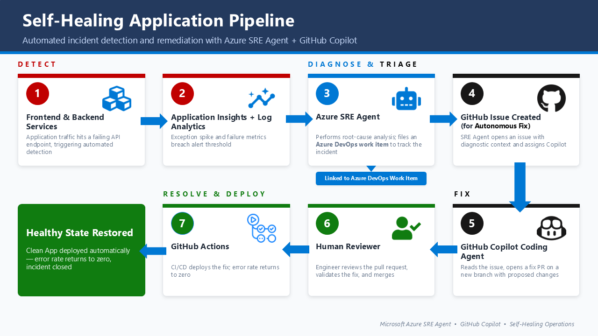

# Self-Healing Application Pipeline

> Automated incident detection and remediation with Azure SRE Agent + GitHub Copilot

For background and architecture context, see the companion article:
[Beyond the Alert: Building Self-Healing Pipelines with Azure SRE Agent and GitHub Copilot](https://stochasticcoder.com/2026/04/29/beyond-the-alert-building-self-healing-pipelines-with-azure-sre-agent-and-github-copilot/)



---

## Overview

Traditional incident response is manual: an alert fires, an on-call engineer is paged, they investigate logs, file a ticket, fix the code, open a PR, and wait for CI/CD. The whole cycle can take hours.

This demo collapses that loop. [**Azure SRE Agent**](https://learn.microsoft.com/en-us/azure/sre-agent/overview?tabs=task) continuously monitors Application Insights telemetry, performs root-cause analysis when anomalies appear, and hands structured findings to GitHub Copilot — which opens a fix PR without waiting for a human to start the investigation. The only human step is reviewing and merging the PR.

---

## How It Works

| Step | Tool | What happens |
|------|------|-------------|
| 1 | Container Apps + Load Generator | Synthetic traffic hits a deliberately broken API |
| 2 | Application Insights / Log Analytics | Exception rate spike and failure metrics detected |
| 3 | Azure SRE Agent | Root-cause analysis; files an Azure DevOps work item to track the incident |
| 4 | Azure SRE Agent | Creates a GitHub Issue with diagnostic context; assigns the Copilot coding agent |
| 5 | GitHub Copilot Coding Agent | Reads the GitHub Issue, opens a fix PR on a new branch |
| 6 | Human reviewer | Reviews the PR and merges — the human gate |
| 7 | GitHub Actions | CI/CD deploys the fix; error rate returns to zero |

---

## Workflow


**Infrastructure** — all deployed via Terraform:

| Resource | Purpose |
|----------|---------|
| Azure Container Registry | Stores `sre-api` and `sre-loadgen` images |
| Azure Container Apps | Hosts the FastAPI backend |
| Container Apps Job | Runs the synthetic load generator on a 5-minute cron |
| Cosmos DB | Order and customer data |
| Log Analytics + Application Insights | Telemetry collection and querying |
| Key Vault + Managed Identity | Secure credential management |
| Azure SRE Agent (`Microsoft.App/agents`) | AI-driven monitoring and investigation |

---

## Quick Start

```powershell
git clone https://github.com/jonathanscholtes/azure-sre-agent-github-demo
cd azure-sre-agent-github-demo
az login
.\deploy.ps1 -Subscription "<subscription-name-or-id>" -SetupGitHub
```

→ [Full deployment guide](docs/deployment.md) — infrastructure, GitHub OIDC, SRE Agent portal configuration, branch protection setup, and troubleshooting tips.

→ [Walkthrough](docs/walkthrough.md) — bug injection, live demo flow, and reset instructions.

---

## Learn More

- [Azure SRE Agent overview](https://learn.microsoft.com/en-us/azure/sre-agent/overview?tabs=task)
- [Azure Container Apps](https://learn.microsoft.com/en-us/azure/container-apps/overview)
- [GitHub Copilot coding agent](https://docs.github.com/en/copilot/using-github-copilot/using-claude-sonnet-in-github-copilot)
- [Application Insights](https://learn.microsoft.com/en-us/azure/azure-monitor/app/app-insights-overview)

---

## License

This project is licensed under the [MIT License](LICENSE.md).

---

## Disclaimer

**This code is provided for educational and demonstration purposes only.**

It is not intended for production use and is provided "AS IS" without warranty of any kind. Users are responsible for ensuring compliance with applicable regulations and security requirements. Azure services incur costs — monitor your usage and delete resources when you are done.
