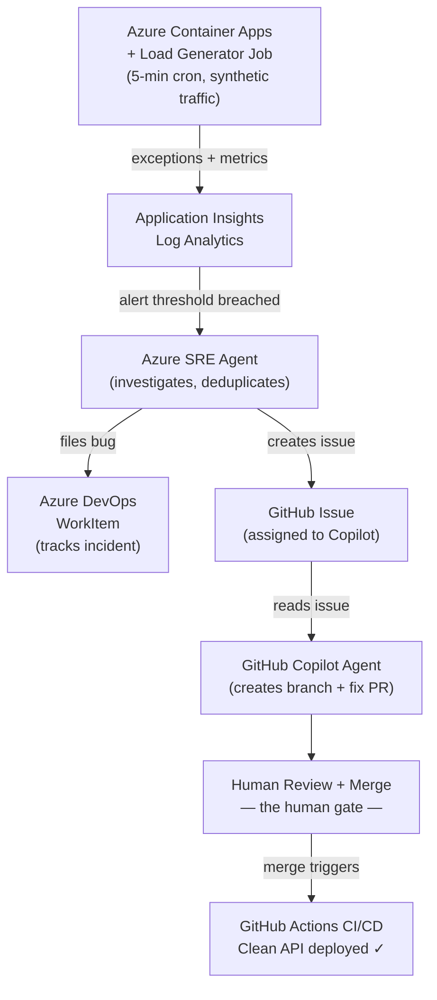

# Azure SRE Agent – Closed-Loop Reliability Demo

A hands-on demonstration of **AI-assisted site reliability engineering** — from automatic failure detection through root-cause investigation, bug filing, and self-directed code repair, with a human approving the final merge.

```
Bug injected → Application Insights detects errors
             → Azure SRE Agent investigates
               ├── Files ADO WorkItem  (tracks the incident)
               └── Creates GitHub Issue (assigned to Copilot coding agent)
                     → Copilot opens a fix PR
                     → Human reviews & merges
                     → CI/CD deploys clean code  ✓
```

---

## Why This Matters

Traditional incident response is manual: an alert fires, an on-call engineer is paged, they investigate logs, file a ticket, fix the code, open a PR, and wait for CI/CD. The whole cycle can take hours.

This demo collapses that loop. [**Azure SRE Agent**](https://learn.microsoft.com/en-us/azure/sre-agent/overview?tabs=task) continuously monitors Application Insights telemetry, performs root-cause analysis when anomalies appear, and hands structured findings to GitHub Copilot — which opens a fix PR without waiting for a human to start the investigation. The only human step is reviewing and merging the PR.

The result is a workflow that is faster, more consistent, and leaves a complete audit trail at every stage.

---

## What This Demo Shows

| Step | Tool | What happens |
|------|------|-------------|
| 1 | Container Apps + Load Generator | Synthetic traffic hits a deliberately broken API |
| 2 | Application Insights | Exception rate spike and failure metrics detected |
| 3 | Azure SRE Agent | Root-cause analysis; files an ADO WorkItem to track the incident |
| 4 | Azure SRE Agent | Creates a GitHub Issue with diagnostic context; assigns the Copilot coding agent |
| 5 | GitHub Copilot Coding Agent | Reads the GitHub Issue, opens a fix PR on a new branch |
| 6 | Human reviewer | Reviews the PR and merges — the human gate |
| 7 | GitHub Actions | CI/CD deploys the fix; error rate returns to zero |

---

## Architecture



**Infrastructure** — all deployed via Terraform:

| Resource | Purpose |
|----------|---------|
| Azure Container Registry | Stores `sre-api` and `sre-loadgen` images |
| Azure Container Apps | Hosts the FastAPI backend |
| Container Apps Job | Runs the synthetic load generator on a 5-minute cron |
| Cosmos DB | Order and customer data |
| Log Analytics + Application Insights | Telemetry collection and querying |
| Key Vault + Managed Identity | Secure credential management |
| Azure SRE Agent (`Microsoft.App/agents`) | AI-driven monitoring and investigation |

---

## Prerequisites

| Tool | Version | Notes |
|------|---------|-------|
| [Terraform](https://developer.hashicorp.com/terraform/install) | >= 1.5 | |
| [Azure CLI](https://learn.microsoft.com/cli/azure/install-azure-cli) | latest | |
| [PowerShell](https://learn.microsoft.com/powershell/scripting/install/installing-powershell) | >= 7 | |
| [GitHub CLI](https://cli.github.com/) | latest | Required for OIDC setup |
| Azure subscription | | Contributor + User Access Administrator |
| Azure DevOps organization | | Required for SRE Agent bug filing |
| GitHub Copilot Enterprise | | Required for coding agent PR creation |

> **Region constraint**: The SRE Agent resource (`Microsoft.App/agents`) is currently available only in `eastus2`, `swedencentral`, `uksouth`, and `australiaeast`. Set `location` in `terraform.tfvars` accordingly.

---

## Deployment

### 1. Clone and authenticate

```powershell
git clone https://github.com/jonathanscholtes/azure-sre-agent-github-demo
cd azure-sre-agent-github-demo
az login
```

### 2. Deploy infrastructure and containers

```powershell
.\deploy.ps1 -Subscription "<subscription-name-or-id>"
```

The script runs four phases automatically:

| Phase | What happens |
|-------|-------------|
| 0 – Bootstrap | Creates Azure Storage for Terraform remote state |
| 1 – Infrastructure | `terraform init / plan / apply` across all modules |
| 2 – Containers | Builds and pushes `sre-api` and `sre-loadgen` to ACR |
| 3 – Demo data | Seeds Cosmos DB with sample customers and orders |

Subsequent runs skip the bootstrap step:

```powershell
.\deploy.ps1 -SkipBootstrap
```

### 3. Set up GitHub Actions CI/CD

Wire up OIDC federated credentials and GitHub repository secrets:

```powershell
.\deploy.ps1 -SetupGitHub
# or standalone:
.\scripts\New-GitHubOidc.ps1
```

This creates an Entra app registration, grants it Contributor on the subscription, and sets the following GitHub secrets:

- `AZURE_CLIENT_ID`
- `AZURE_TENANT_ID`
- `AZURE_SUBSCRIPTION_ID`
- `AZURE_SP_OBJECT_ID`

You also need to set one secret manually after the bootstrap phase completes:

```
TF_STATE_STORAGE_ACCOUNT = <storage account name printed by deploy.ps1 phase 0>
```

### 4. Connect SRE Agent to Azure DevOps (Azure portal)

After `terraform apply` completes:

1. Open the SRE Agent resource in the Azure portal
2. Go to **Workflows** → add a new workflow
3. Set the **trigger**: Log Analytics workspace connected to Application Insights — the agent queries exception rates and failure metrics
4. Set the **destination**: your ADO organization, project, and board; work item type **Bug**
5. Save — the agent will now create an ADO WorkItem automatically when an anomaly is detected, including the exception type, stack trace, and telemetry deep-links

### 5. Connect SRE Agent to GitHub Issues (Azure portal)

In the same or a parallel workflow in the SRE Agent portal:

1. Add a **GitHub** destination
2. Authenticate and select this repository
3. Set the assignee to **GitHub Copilot** (the coding agent)
4. Save — the agent will now open a GitHub Issue with diagnostic context and assign Copilot to resolve it

> Both the ADO WorkItem and the GitHub Issue come from the same investigation. ADO tracks the incident operationally; the GitHub Issue is the work item Copilot acts on.

### 6. Enable branch protection on `main`

This enforces the human gate — Copilot's fix PR cannot merge without a review.

1. Go to **Settings → Branches → Add branch ruleset**
2. Target: `main`
3. Enable:
   - **Require a pull request before merging** (1 required approval)
   - **Require status checks to pass** → add `Validate` (from `validate.yml`)
   - **Block force pushes**

---

## Running the Demo

### Inject the bug and generate errors

```powershell
.\tools\Start-SreDemo.ps1
```

This patches a realistic bug into the order management API, rebuilds and redeploys the container image via ACR, waits for the new revision to become healthy, then fires a burst of 20 orders to flood Application Insights with errors. Direct portal deep-links are printed for every presenter step.

```powershell
# Inject a specific bug type with a larger load burst
.\tools\Start-SreDemo.ps1 -Bug KeyError -LoadCount 30

# Patch source only — let GitHub Actions CI/CD handle the deploy
.\tools\Start-SreDemo.ps1 -SkipDeploy
```

**Bug types:**

| Bug | What breaks | Symptom |
|-----|-------------|---------|
| `KeyError` | `unit_price` key renamed to `price` in invoice calculation | Every `POST /api/orders/{id}/process` returns 500 |
| `AttributeError` | `req.lineItems` accessed instead of `req.line_items` | Every `POST /api/orders` returns 500 |
| `Random` | One of the above, chosen at random (default) | |

> **`-SkipDeploy`** patches the source file and writes `.chaos-state` but skips the ACR build. Commit and push to trigger the GitHub Actions workflow — useful for demonstrating the full CI/CD path.

### Presenter walkthrough

| Step | Where to look | What to show |
|------|---------------|-------------|
| 1 | Application Insights → **Failures** blade | Error rate spike, exception type, stack trace |
| 2 | [Azure SRE Agent](https://learn.microsoft.com/en-us/azure/sre-agent/overview?tabs=task) portal | Agent investigating the anomaly in real time |
| 3 | Azure DevOps Boards | Auto-created Bug WorkItem with telemetry deep-link |
| 4 | GitHub Issues | Issue created by SRE Agent, assigned to Copilot |
| 5 | GitHub Pull Requests | Copilot's fix PR on a new branch |
| 6 | Merge the PR | CI/CD pipeline triggers; error rate returns to zero |

### Reset after the demo

```powershell
.\tools\Invoke-ChaosBug.ps1 -Revert `
    -ContainerRegistryName <acr-name> `
    -ResourceGroupName     <resource-group> `
    -BackendAppName        <container-app-name>
```

`Start-SreDemo.ps1` prints the exact reset command with your environment's values at the end of its output.

---

## Project Structure

<details>
<summary>Expand to view repository layout</summary>

```
.
├── .github/
│   └── workflows/
│       ├── deploy.yml      # CI/CD: Terraform + ACR build + health check + seed
│       └── validate.yml    # PR gate: Terraform fmt/validate + Python linting
├── apps/
│   ├── api/                # FastAPI order-management backend (Python 3.12)
│   │   ├── Dockerfile
│   │   ├── main.py
│   │   └── app/
│   │       ├── routes/     # health, customers, orders, demo
│   │       └── stores/     # Cosmos DB stores with in-memory fallback
│   └── loadgen/            # Synthetic load generator (Container Apps Job, 5-min cron)
├── infra/
│   ├── main.tf             # Wires all six modules
│   ├── variables.tf
│   ├── outputs.tf
│   ├── providers.tf        # azurerm ~> 4.0, azapi ~> 2.0
│   ├── terraform.tfvars.example
│   └── modules/
│       ├── security/       # Managed Identity + Key Vault
│       ├── monitor/        # Log Analytics + Application Insights
│       ├── platform/       # ACR + Container App Environment
│       ├── data/           # Cosmos DB (orders + customers containers)
│       ├── apps/           # Container App + Load Generator Job
│       └── sre-agent/      # Azure SRE Agent (azapi preview resource)
├── scripts/
│   ├── Deploy-Infrastructure.ps1
│   ├── Deploy-Containers.ps1
│   ├── New-GitHubOidc.ps1
│   └── common/DeploymentFunctions.psm1
├── tools/
│   ├── Start-SreDemo.ps1   # Demo orchestrator + presenter guide
│   └── Invoke-ChaosBug.ps1 # Inject / revert intentional bugs
└── deploy.ps1              # Main deployment orchestrator
```

</details>

---

## Terraform Variables

Copy `infra/terraform.tfvars.example` to `infra/terraform.tfvars` and fill in your values. `deploy.ps1` generates this file automatically during deployment.

| Variable | Required | Description |
|----------|----------|-------------|
| `subscription_id` | Yes | Azure subscription ID |
| `environment_name` | Yes | Short environment label, e.g. `dev` |
| `project_name` | Yes | Used in resource naming |
| `location` | Yes | Azure region — see SRE Agent region constraint above |
| `resource_token` | No | Unique suffix; auto-generated if empty |
| `enable_sre_agent` | No | Defaults to `true` |
| `sre_agent_access_level` | No | `High` (Reader + Contributor) or `Low` (Reader only) |

---

## API Reference

The FastAPI backend exposes interactive docs at `<api-url>/docs`.

| Method | Path | Description |
|--------|------|-------------|
| GET | `/health` | Health check including Cosmos DB connectivity |
| GET | `/api/customers` | List customers |
| GET | `/api/orders` | List orders |
| POST | `/api/orders` | Create an order |
| GET | `/api/orders/{id}` | Get order details |
| POST | `/api/orders/{id}/process` | Process an order — invoice generation (bug injection target) |
| POST | `/api/demo/seed` | Seed sample customers and orders |
| POST | `/api/demo/simulate-load` | Generate a synthetic load burst |

---

## Clean Up

```powershell
# Via the deploy script
.\deploy.ps1 -Subscription "<subscription-name-or-id>" -Destroy

# Or delete the resource group directly
az group delete --name <resource-group-name> --yes --no-wait
```

> The Terraform remote state storage account is in a separate resource group (`rg-tfstate-sre`) and is **not** deleted by the above commands. Delete it manually when you no longer need it.

---

## Learn More

- [Azure SRE Agent overview](https://learn.microsoft.com/en-us/azure/sre-agent/overview?tabs=task)
- [Azure Container Apps](https://learn.microsoft.com/en-us/azure/container-apps/overview)
- [GitHub Copilot coding agent](https://docs.github.com/en/copilot/using-github-copilot/using-claude-sonnet-in-github-copilot)
- [Application Insights](https://learn.microsoft.com/en-us/azure/azure-monitor/app/app-insights-overview)

---

## License

This project is licensed under the [MIT License](LICENSE.md).

---

## Disclaimer

**This code is provided for educational and demonstration purposes only.**

It is not intended for production use and is provided "AS IS" without warranty of any kind. Users are responsible for ensuring compliance with applicable regulations and security requirements. Azure services incur costs — monitor your usage and delete resources when you are done.
